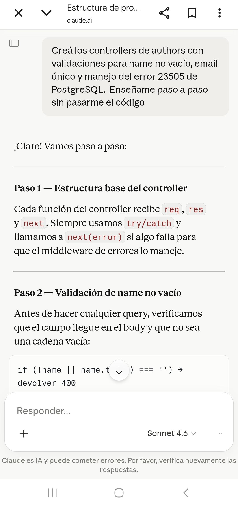
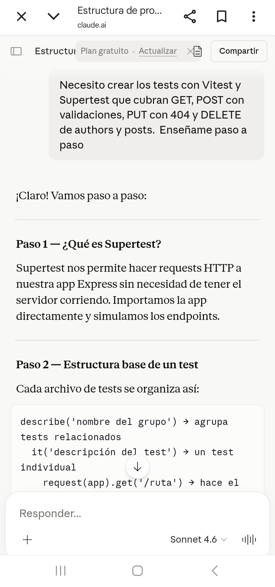
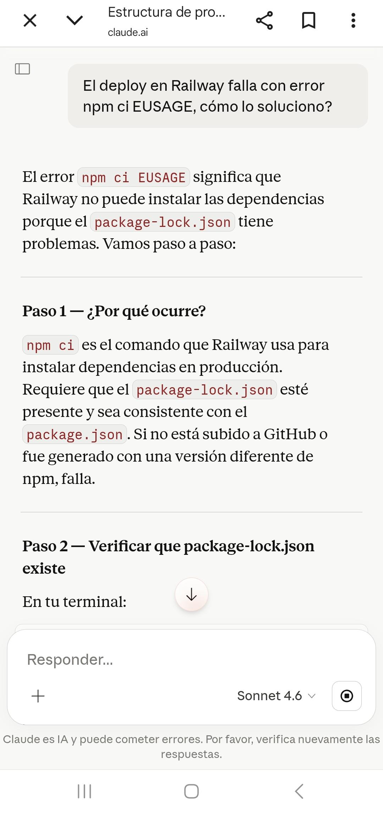
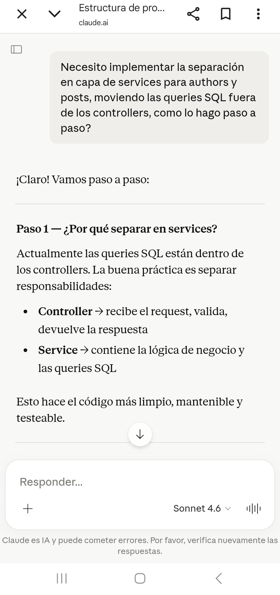

# PI-MINI-BLOG

API REST para gestión de autores y posts, desarrollada con Node.js, Express y PostgreSQL.

## Tecnologías

- Node.js
- Express
- PostgreSQL (pg)
- Vitest + Supertest
- Railway (deploy)

---

## Requisitos previos

- Node.js v18 o superior
- PostgreSQL instalado y corriendo

---

## Instalación local

### 1. Clonar el repositorio

```bash
git clone https://github.com/NadiaStarna/ProyectoM2-NadiaStarna.git
cd PI-MINI-BLOG
```

### 2. Instalar dependencias

```bash
npm install
```

### 3. Configurar variables de entorno

Copiá el archivo de ejemplo y completá con tus datos:

```bash
cp .env.example .env
```

### 4. Crear la base de datos

Abrí el SQL Shell (psql) y ejecutá:

```sql
CREATE DATABASE miniblog;
\c miniblog
```

### 5. Ejecutar el script SQL

Pegá el contenido de `src/db/setup.sql` en el SQL Shell para crear las tablas y cargar los datos de prueba.

### 6. Iniciar el servidor

```bash
npm run dev
```

El servidor estará corriendo en http://localhost:3000

---

## Endpoints disponibles

### Authors

| Método | Endpoint | Descripción |
|--------|----------|-------------|
| GET | /api/authors | Listar todos los autores |
| GET | /api/authors/:id | Obtener autor por ID |
| POST | /api/authors | Crear autor |
| PUT | /api/authors/:id | Actualizar autor |
| DELETE | /api/authors/:id | Eliminar autor |

### Posts

| Método | Endpoint | Descripción |
|--------|----------|-------------|
| GET | /api/posts | Listar todos los posts |
| GET | /api/posts/:id | Obtener post por ID |
| GET | /api/posts/author/:authorId | Posts de un autor con detalle |
| POST | /api/posts | Crear post |
| PUT | /api/posts/:id | Actualizar post |
| DELETE | /api/posts/:id | Eliminar post |

---

## Tests

```bash
npm test
```

Corre 23 tests unitarios con Vitest y Supertest cubriendo todos los endpoints.

---

## Documentación OpenAPI

El archivo `openapi.yaml` en la raíz contiene la documentación completa de la API.

Para visualizarla online:
1. Entrá a https://editor.swagger.io
2. Copiá y pegá el contenido de `openapi.yaml`

---

## Deploy en Railway

La API está desplegada en Railway.

**URL pública:** https://proyectom2-nadiastarna-production-dc94.up.railway.app

### Variables de entorno en Railway

| Variable | Valor |
|----------|-------|
| DB_HOST | postgres.railway.internal |
| DB_PORT | 5432 |
| DB_USER | postgres |
| DB_PASSWORD | (privado) |
| DB_NAME | railway |
| PORT | 3000 |

### Pasos para redeploy

1. Hacer push a `main` en GitHub
2. Railway redeploya automáticamente

---

## Registro de uso de IA

**Herramienta utilizada:** Claude (Anthropic)

### Prompts utilizados

**1. Controllers de authors con validaciones:**


**2. Tests con Vitest y Supertest:**


**3. Error npm ci en Railway:**


**4. Separación en capa de services:**


### Cómo influyó en el desarrollo

La IA fue utilizada como guía técnica a lo largo de todo el proyecto:

- **Implementación de endpoints:** ayudó a crear los controllers 
con validaciones de campos obligatorios, control de email único 
y manejo del error 23505 de PostgreSQL.

- **Testing:** guió la implementación de los 23 tests con Vitest 
y Supertest cubriendo flujos exitosos y casos de error como 
400, 404 y validaciones.

- **Resolución de errores:** permitió diagnosticar y resolver el 
error npm ci EUSAGE que impedía el deploy en Railway.

- **Buenas prácticas:** sugirió la separación en capa de services 
moviendo las queries SQL fuera de los controllers para mejorar 
la arquitectura del proyecto.

Todo el código fue revisado, comprendido y adaptado por la 
desarrolladora antes de ser incorporado al proyecto.Prompt 4.jpeg)

#
## DESARROLLADORA: Starna Nadia. 