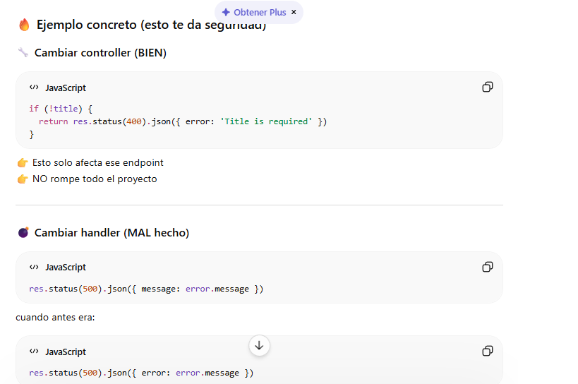
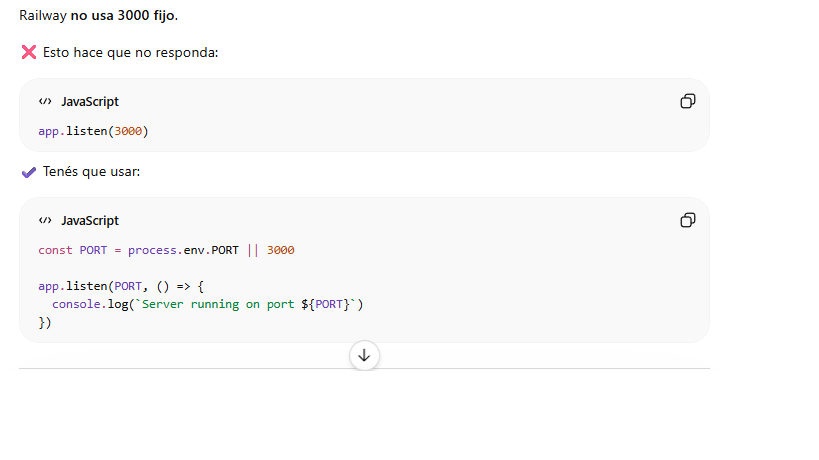
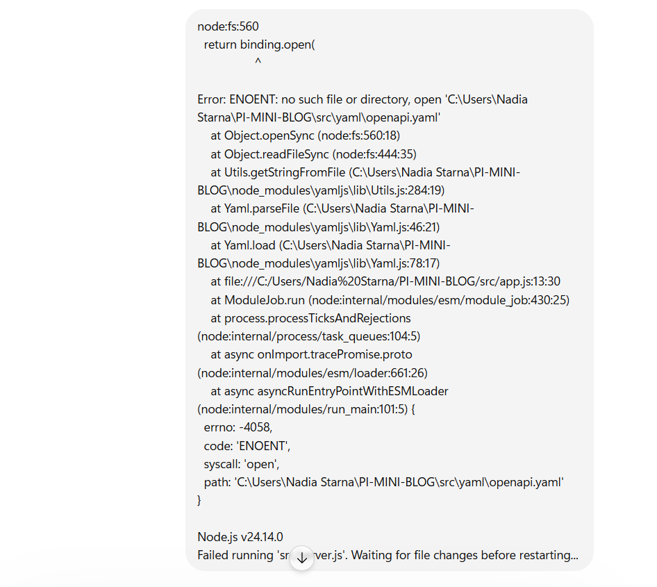
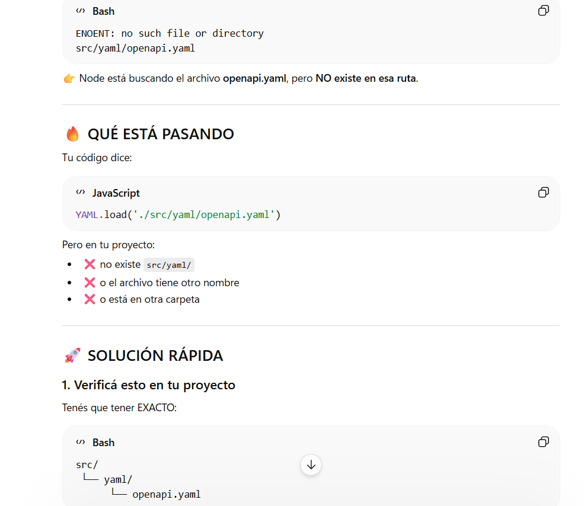
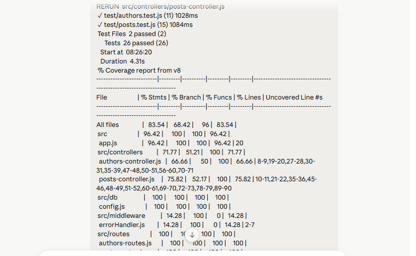
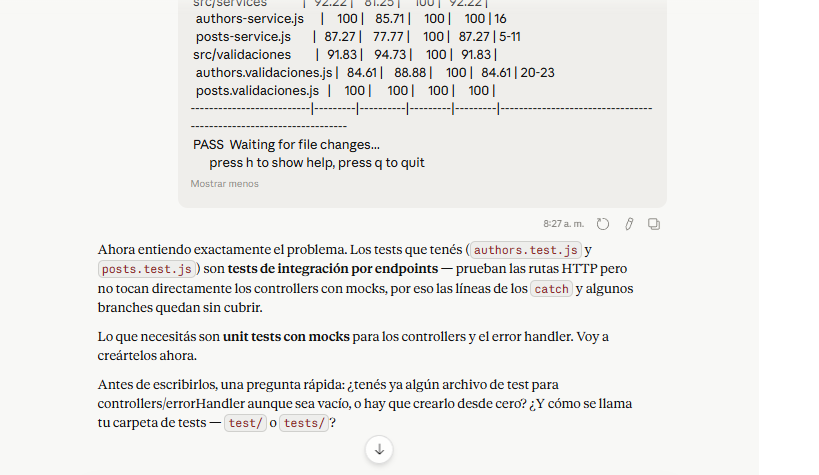

# Uso de la Inteligencia Artificial

## Prompt 1

**Prompt:**  
Estoy usando Swagger con un archivo YAML, pero no me aparecen los endpoints en la documentación. Ya configuré
swagger-ui-express, ¿qué puede estar mal en la ruta o en la referencia del archivo?

**Objetivo:**  
Detectar por qué Swagger no mostraba los endpoints.

**Resultado obtenido:**  
La IA sugirió revisar la ruta del archivo YAML y cómo estaba siendo importado en la configuración.

---

## Prompt 2

**Prompt:**  
Desplegué mi API en Railway pero al acceder a la URL no responde o queda cargando. 

**Objetivo:**  
Identificar por qué la API no respondía en producción.

**Resultado obtenido:**  
La IA indicó que debía usar `process.env.PORT` en lugar de un puerto fijo.

---

## Prompt 3

**Prompt:**  
(Le pasé el error que me daba en la terminal como se ve en prompt3.png)

**Objetivo:**  
Entender por que el sustema arroja un error relacionado con yaml.load y como solucionarlo para que el proyecto
funcione correctamente.

**Resultado obtenido:**  
La IA indicó que el error se debe a que el código está intentando cargar un archivo YAML que no existe en la ruta
esperada (src.yaml o openapi.yaml). La solución sugerida fue verificar que el archivo exista, que tenga el nombre
correcto y que esté ubicado en la carpeta correcta dentro del proyecto.

---

## Prompt 4

**Prompt:**  
Se adjuntó la ejecución del proyecto en la terminal donde aparece el error: Route.get() requires a callback
function but got a [object Undefined] en el archivo authors-routes.js.

**Objetivo:**  
Identificar la causa del error en las rutas de Express, específicamente por qué authorsController.getAuthors
aparece como undefined, y corregir la importación o exportación del controlador.

**Resultado obtenido:**  
La IA explicó que el problema se debe a que el método getAuthors no está siendo correctamente importado desde el
controlador. Esto suele ocurrir cuando el nombre del archivo o la exportación no coincide con el import en
authors-routes.js. Se recomendó verificar el nombre exacto del archivo del controlador, su exportación y corregir
la línea de importación para asegurar que authorsController.getAuthors exista y esté bien referenciado.

